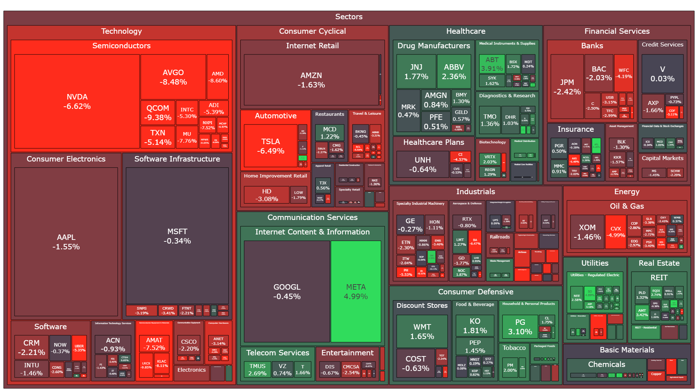
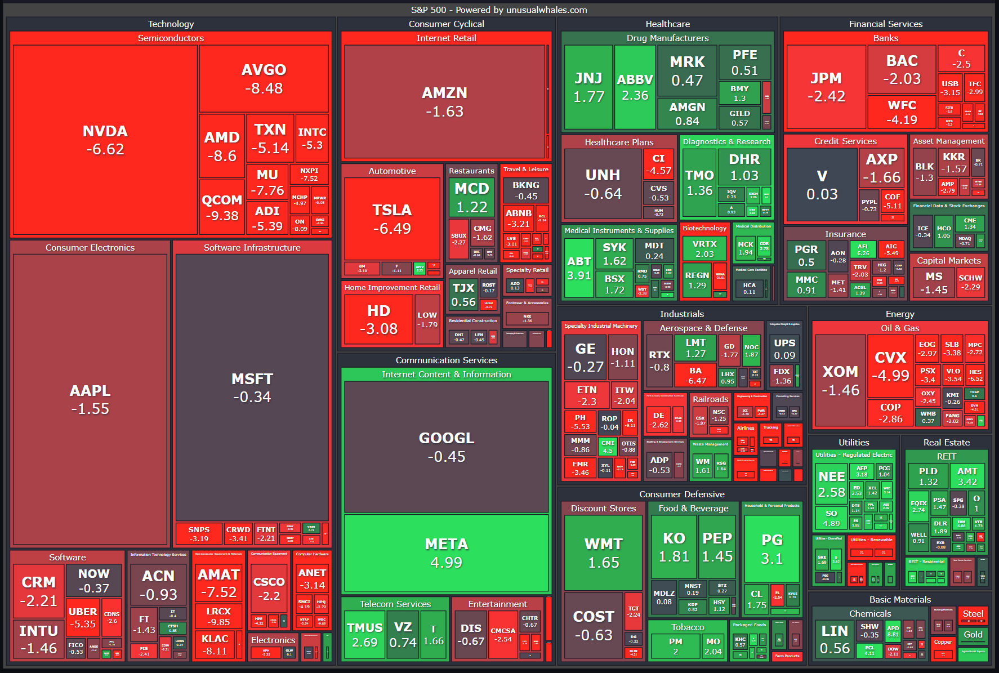

# S&P 500 Heatmap 📊

This project is a simple Python script that generates a heatmap of the S&P 500 index using the data from the Unusual Whales API. It is meant to look like the heatmap on the [Unusual Whales website](https://unusualwhales.com/heatmaps).

<p align="center">
  
  
  <a href="https://github.com/psf/black"></a>
</p>

---

## Introduction

If you have traded stocks you have probably come across the S&P 500 index and the heatmaps that are used to visualize the performance of the index. It provides a quick overview of the performance of the index and can be used to identify trends and patterns. There are many sites that provide these heatmaps, but I wanted to create my own version using Python.

## Installation ⚙️

The required packages to run this code can be found in the requirements.txt file. To run this file, execute the following code block after cloning the repository:

```bash
pip install -r requirements.txt
```

## Usage ⌨️

To generate the chart, simply run the script using the following command:

```bash
python src/main.py
```

## Example 📊

The following chart is an example of the output generated by the script.


### References 📚

The following image was used as a reference to create the funding rate heatmap.


## Other Projects 📦

This project is part of a series of projects that I have created. You can find the other projects in the following list:

- [Total Liquidation Chart](https://github.com/StephanAkkerman/liquidations-chart)
- [Bitcoin Rainbow Chart](https://github.com/StephanAkkerman/bitcoin-rainbow-chart)
- [Live Binance Charts](https://github.com/StephanAkkerman/live-binance-charts)
- [RSI Heatmap](https://github.com/StephanAkkerman/crypto-rsi-heatmap)
- [Funding Rate Heatmap](https://github.com/StephanAkkerman/funding-rate-heatmap)
